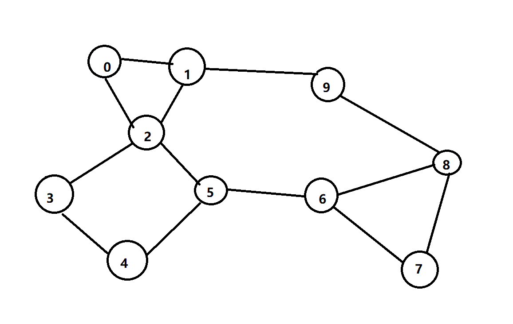
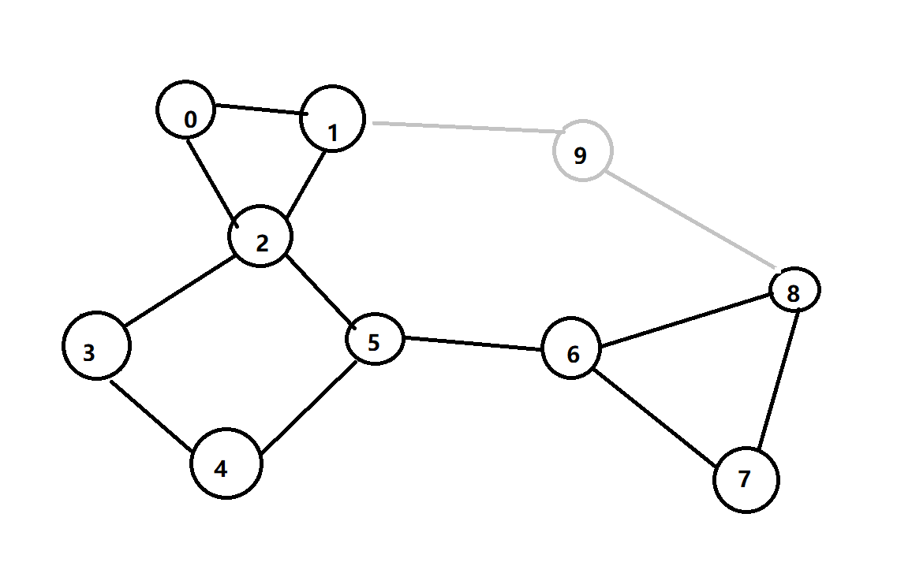
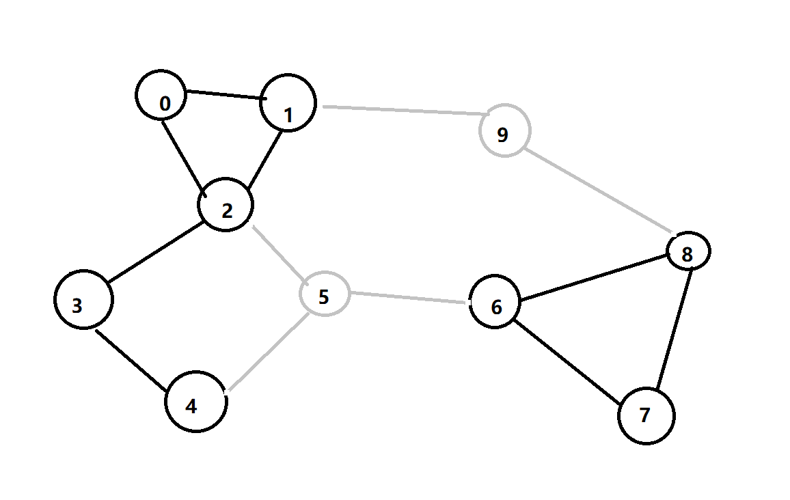
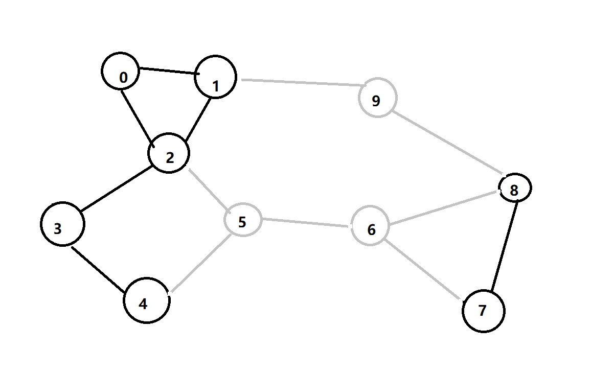

adjacent list representation of graph using rocksdb
# representaion
- simple_adjlist.cpp:
    - key: vertex 
    - value: neighbors (each: vertex)

- link_adjlist.cpp: friendly to graph reduction and recovery in search with backtrack, inspired by "dancing link"
    - key: vertex 
    - value: next vertex; degree; first neighbor's index in neighbors; neighbors  (each: {vertex, next neighbor's index})
# build

requirements: rocksdb installed( librocksdb.a and lbrocksdb.so can be found by $PATH)

```
mkdir build
cd build
make link_rdb_eg
make simple_rdb_eg
```
# run

under build/

```
exe_name graph_file_path db_path
```

eg: 
```
./link_rdb_eg ../test_graph.txt ../link_db
```
# reference

https://github.com/facebook/rocksdb/wiki/Basic-Operations

https://github.com/pmem/pmem-rocksdb/blob/master/include/rocksdb/slice.h

https://github.com/facebook/rocksdb/blob/main/util/status.cc

# graph

test_graph.txt

visualization:



remove vertex 9:



remove vertex 9 5:



remove vertex 9 5 6:


